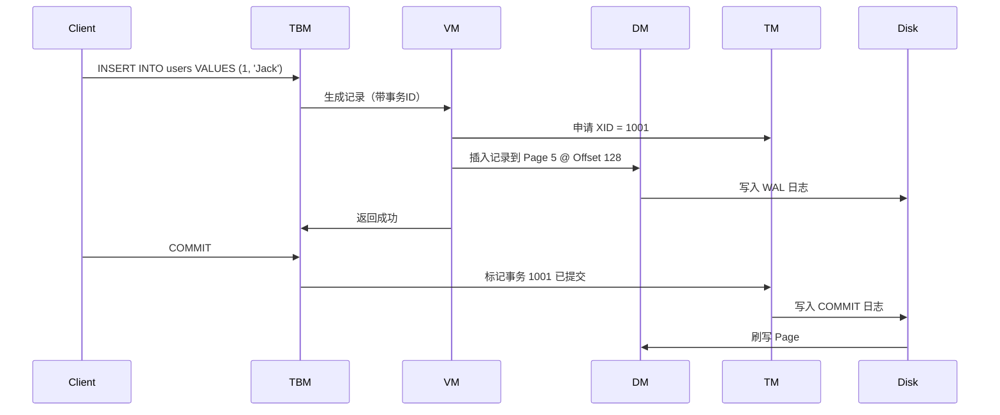
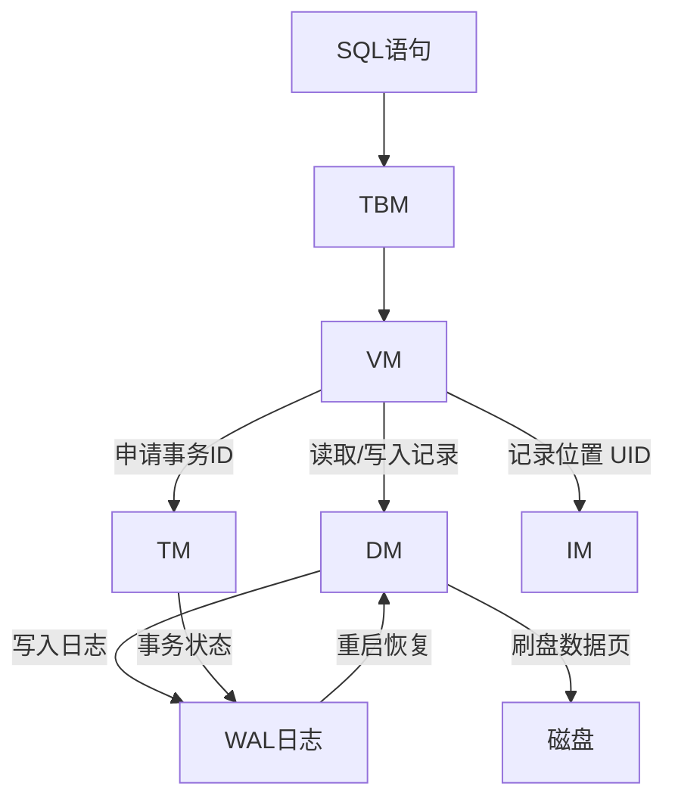

WAL（**Write-Ahead Logging**，预写日志）是一种**事务恢复机制**，它的核心思想是：

> **所有对数据库的修改，必须先写入日志，再修改实际数据文件。**

这是保证数据库**原子性（Atomicity）和持久性（Durability）**的关键技术。


`DataItem` 是数据库中“最小可操作数据单元”；

**一个 `DataItem` 就代表一次数据库操作中“作用在页上的一个数据单位”**，比如一次 `insert` 或一次 `update` 操作的对象。

一个Page中有多个DataItem

 它被存储在 `Page` 中，`Page` 被管理在 `PageCache` 里；pageCache中存的是页，也提供了get方法去获取页；从pagecache中根据页码就可以获取对应的页
 `Logger` 负责记录所有对 `DataItem` 的修改操作，以便崩溃后恢复。


## 总结图示




## Quark完成工作流程

好的，我们来 **总结 MYDB 的整个流程** ——从一条 SQL 的执行开始，到数据的存储与事务控制结束。这个数据库是一个从 0 实现的简易关系型数据库系统，但功能非常完整，涵盖了文件存储、缓存、事务、并发控制、索引等多个关键子系统。

------

## 🧠 一句话总结 MYDB：

> **MYDB 是一个基于页存储的嵌入式数据库，采用模块化设计，支持事务、并发控制、日志恢复与索引结构，从 SQL 到底层数据存储都由自己实现。**

------

## 🧱 整体模块架构

```text
用户输入 SQL
     ↓
TBM (Table Manager) - 解析语法，管理元数据
     ↓
VM (Version Manager) - 负责并发控制与可见性
     ↓
DM (Data Manager) - 负责页读写与 WAL 日志
     ↓
TM (Transaction Manager) - 负责事务状态管理
     ↓
磁盘文件（表文件 + 索引文件 + 日志文件）
```

------

## 🔁 一条 SQL 的执行完整流程

以 `INSERT INTO users VALUES (1, 'Jack')` 为例：

### 1️⃣ SQL 语句进入 TBM（Table Manager）

- 解析 SQL
- 确定目标表名 `users`，查找表结构（列定义、索引信息等）
- 调用 VM 执行插入操作

### 2️⃣ VM（Version Manager）执行业务逻辑

- 向 TM 请求事务号 XID
- 封装插入记录，添加版本控制信息（如事务 ID、可见性标识）
- 生成记录内容（带 MVCC 信息）
- 调用 DM 写入数据页，记录位置为 UID（页号+偏移量）

### 3️⃣ DM（Data Manager）写入数据页

- 选择或分配一个合适的 Page（页缓存）
- 在页中写入数据，更新页内部结构（如空闲指针）
- 返回 `UID = PageNo + Offset`，用于定位记录

### 4️⃣ 写入 WAL 日志（Write Ahead Log）

- 生成 REDO 日志（包括页号、偏移量、数据前/后状态）
- 写入日志文件（可能还未立即刷盘）

### 5️⃣ 返回 UID 给 VM，再返回 TBM

- VM 将记录的 UID 存入索引（如 B+ 树）
- 完成插入操作

### 6️⃣ 提交事务（用户发送 COMMIT）

- TM 修改事务状态为 `COMMITTED`
- WAL 中添加 COMMIT 标记
- 根据刷盘策略，将页/日志刷盘，保证持久性

------

## 💽 存储结构

### 数据文件（*.db）

- 被分页（Page）管理，每页大小如 8KB

- 每页结构：

  ```
  [页头][记录目录][记录数据]
  ```

- 每条记录结构：

  ```
  [事务ID][版本链][列值]
  ```

### 日志文件（*.log）

- 按顺序追加，格式如下：

  ```
  [XID][PageNo][Offset][Before][After]
  ```

------

## 🔄 并发控制与 MVCC

- 每条记录都标记所属的事务 ID 和版本链指针
- 读操作根据当前事务的可见性判断是否能读
- 插入/更新操作创建新版本，旧版本挂在版本链上

------

## 🧨 恢复流程（系统崩溃重启后）

1. 扫描日志文件
2. 根据事务状态：
   - COMMITTED：重做 REDO
   - ACTIVE/ABORTED：执行 UNDO
3. 重建页缓存与索引结构

------

## 🗂 元数据管理（系统表）

用系统表来记录数据库自身的结构信息：

- `mydb_tables`：表的名称、根页等
- `mydb_columns`：每个表的列定义
- `mydb_indexes`：B+ 树根页、对应字段等

------

## 🧩 模块职责总结表

| 模块               | 主要职责                                     |
| ------------------ | -------------------------------------------- |
| **TM（事务管理）** | 管理事务 ID，维护事务状态，提供提交/回滚功能 |
| **DM（数据管理）** | 管理数据页、记录读写、日志刷盘、页缓存       |
| **VM（版本管理）** | 实现 MVCC，隔离级别控制，读写并发            |
| **IM（索引管理）** | 实现 B+ 树索引，键值查找与页指针映射         |
| **TBM（表管理）**  | 解析 SQL，维护元数据，操作协调者             |

------

## ✅ 总结图示



------

#### 下面模拟一个具体事务执行过程（带页号、偏移、日志内容等）来更深入理解。

下面我会**模拟 MYDB 中一个完整事务的执行过程**，包含：

- SQL 执行过程
- 页结构和记录写入
- 日志内容（WAL）
- 最后事务提交和恢复流程

------

## 🧪 模拟操作场景

我们模拟执行如下 SQL：

```sql
BEGIN;
INSERT INTO users(id, name) VALUES (1, 'Jack');
COMMIT;
```

------

## 🧱 初始状态

- 数据文件 `users.db` 是空的
- 日志文件 `users.log` 是空的
- 缓存中还未加载任何页
- 当前没有活跃事务

------

## 🧾 1. 开启事务（BEGIN）

### 事务管理器（TM）

- 分配一个事务 ID：XID = **1001**
- 在事务状态表中记录：`XID 1001 = ACTIVE`

------

## ➕ 2. 插入记录

### 表结构

假设 `users` 表有两列：

| 列名 | 类型 | 编号 |
| ---- | ---- | ---- |
| id   | int  | 0    |
| name | str  | 1    |

------

### 记录构造（由 VM 负责）

构造带事务控制信息的记录：

```
[ XMIN=1001 | XMAX=0 | PrevVersion=0 | id=1 | name='Jack' ]
```

记录内容（序列化后）：

```
XID: 1001  
VersionChain: 0  
Payload:  [int:1][str:Jack]
```

假设大小为：80 字节

------

### DM 插入记录

#### 页面分配

- 当前页号为 `PageNo = 5`
- 找到该页有足够空间，从偏移 `Offset = 128` 插入

#### 写入数据页

页内写入：

```
Page[5] @ Offset 128:
[XID=1001][Ver=0][id=1][name='Jack']
```

#### 生成 UID（页索引）

```java
UID = (PageNo << 32) | Offset
    = (5 << 32) | 128
    = 0x0000000500000080
```

------

### 日志写入（WAL）

#### REDO 日志项结构：

```
[XID=1001]
[PageNo=5]
[Offset=128]
[Before=空]
[After=插入的数据（80字节）]
```

追加写入日志文件 `users.log`

> 注：此时日志刷盘策略为 **先写日志，延迟刷页**

------

## ✅ 3. 提交事务（COMMIT）

### TM 更新状态

- 将 `XID=1001` 标记为 `COMMITTED`

### 日志追加：

```
[XID=1001 COMMIT]
```

------

## 💾 4. 刷盘（可选，依赖策略）

- 若采用 group commit，可能延迟刷页
- 当前模拟中执行立即刷盘：

```text
刷写数据页 Page 5 → users.db
刷写日志文件 → users.log
```

------

## 💥 5. 系统崩溃（模拟）

此时断电，系统重启，内存清空，但日志文件和数据页部分已写入。

------

## 🔁 6. 恢复流程

启动后执行如下步骤：

### 步骤 1：扫描日志文件

```text
users.log 内容：
1. [XID=1001][Page=5][Offset=128][Before=空][After=...]
2. [XID=1001 COMMIT]
```

### 步骤 2：判断状态

- XID=1001 是 COMMITTED

### 步骤 3：执行 REDO

- 确保 Page 5 @ Offset 128 包含“Jack”记录
- 如果缺失，重新写入（根据 After 字段）

> 如果事务是未提交的，则执行 UNDO（撤销 Before）

------

## 🔍 最终状态

- users.db 中第 5 页 @ 128 偏移包含 Jack 的记录
- users.log 中有完整的 REDO + COMMIT 日志
- TM 中记录：XID=1001 状态=COMMITTED

------

## 总结图示


